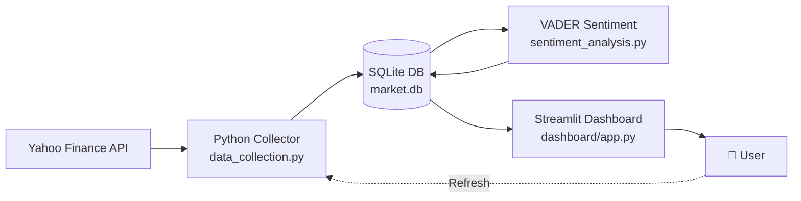

# 📈 Market Sentiment Tracker

> End-to-end data analytics pipeline that scrapes financial news, scores headline sentiment with NLP, correlates it with stock price movements, and visualizes everything in a live interactive dashboard.

### 🔗 [**Live Demo →**](https://prakruti-market-sentiment.streamlit.app/)


---

## 🎯 What This Project Does

This is a **full data pipeline** — not a notebook, not a one-off script — that:

1. **Pulls** real-time financial news headlines and intraday stock prices from Yahoo Finance
2. **Stores** everything in a normalized SQLite database with proper indexes and uniqueness constraints
3. **Scores** every headline with VADER NLP to extract sentiment (positive/negative/neutral)
4. **Joins** news + sentiment + price data on the fly using SQLAlchemy ORM
5. **Visualizes** the relationship between news mood and price movements in an interactive Streamlit dashboard
6. **Updates live** — one click in the sidebar pulls fresh news and re-scores

## 🛠️ Tech Stack


## 🏗️ Architecture



## 📊 Key Findings (from a sample of 77 articles across 7 mega-cap tickers)

- **Overall market mood: bullish** — average compound sentiment of **+0.32** across all tracked tickers.
- **GOOGL led headline positivity** with an average sentiment of **+0.52** — coverage centered on Gemini, AI infrastructure, and valuation upside.
- **META trailed the pack at +0.17** despite being in the same megacap-AI narrative — coverage was more mixed.
- **Negative-language detection worked accurately**: words like "brutal," "panic," "carnage," and "wider losses" reliably surfaced in the bottom-decile headlines.
- News sentiment clustering above a rising price line (visible on the AAPL chart) is consistent with the *narrative-confirmation* effect — bullish coverage tends to accompany, not lead, rallies in this short window.

## 📂 Project Structure
market-sentiment-tracker/
├── dashboard/
│   └── app.py              # Streamlit dashboard
├── src/
│   ├── data_collection.py  # Yahoo Finance news + price fetching
│   ├── database.py         # SQLAlchemy models + helpers
│   └── sentiment_analysis.py  # VADER scoring pipeline
├── data/
│   └── market.db           # SQLite database (committed for demo)
├── images/                 # Dashboard screenshots
├── requirements.txt
└── README.md

## 🚀 Run Locally

```bash
# 1. Clone the repo
git clone https://github.com/Prakruti25/market-sentiment-tracker.git
cd market-sentiment-tracker

# 2. Create and activate a virtual environment
python3 -m venv venv
source venv/bin/activate

# 3. Install dependencies
pip install -r requirements.txt

# 4. Initialize the database (only needed first time)
python src/database.py

# 5. Pull initial data
python src/data_collection.py

# 6. Score sentiment for new articles
python -m src.sentiment_analysis

# 7. Launch the dashboard
streamlit run dashboard/app.py
```

## 📷 Dashboard Views

### Live headlines with mood indicators


### Sentiment leaderboard across tickers


## 🔮 Future Enhancements

- [ ] Add a transformer-based sentiment model (FinBERT) for finance-specific nuance
- [ ] Multi-source news ingestion (Bloomberg RSS, Reuters, SEC filings)
- [ ] Statistical significance testing of sentiment-price correlation
- [ ] Cron-scheduled hourly ingestion via GitHub Actions
- [ ] Add user authentication for personalized watchlists

## 👩‍💻 Author

**Prakruti Patel** — aspiring data analyst at Indiana University
[LinkedIn](https://www.linkedin.com/in/prakruti-patel-/)
---

⭐ If you found this project useful or interesting, consider giving it a star!
